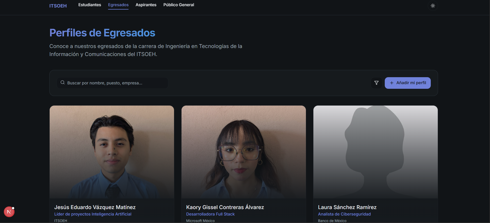
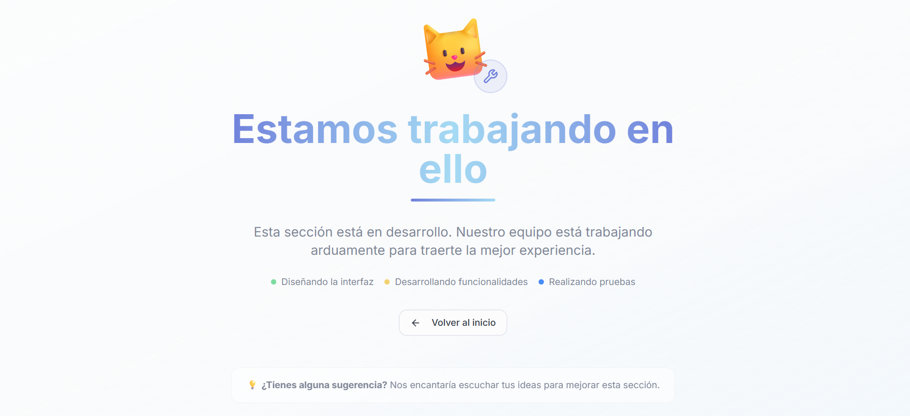
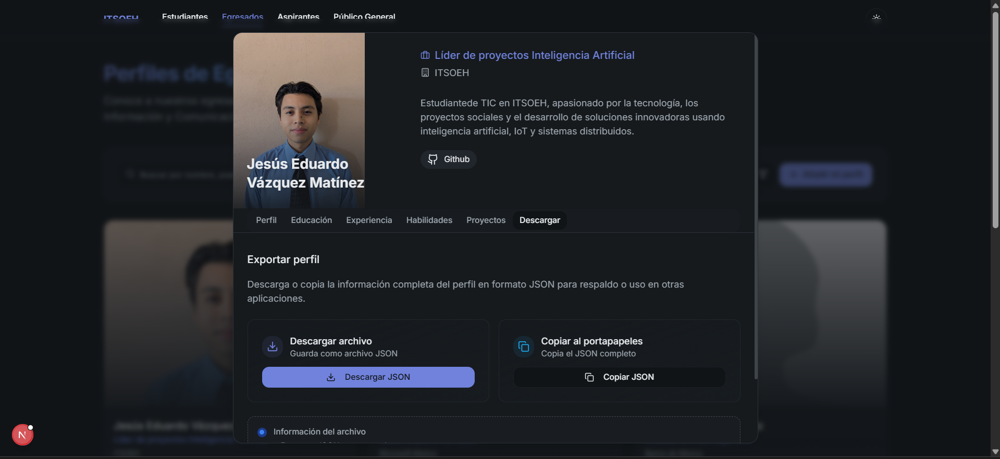
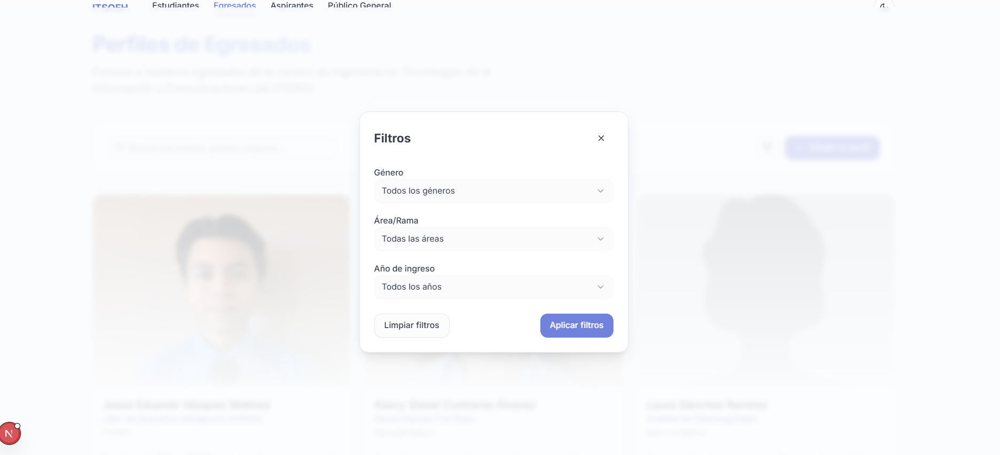

# tics-page-6a-back

**Desarrollado por Jesús Eduardo Vázquez Martínez**
**Puedes acceder a esta página sin necesidad de descargar ningún archivo.**  
👉 Solo entra al siguiente enlace en una nueva pestaña:

https://tics-page-6a-back-lalo.vercel.app
**[https://tics-page-6a-back-lalo.vercel.app]()**

## ✨ Características principales

- 🎴 **Tarjetas de presentación interactivas**  
  - Se muestran **5 tarjetas**, incluyendo **2 reales** de distintos géneros y roles.  
  - Cada tarjeta cuenta con una **previsualización** y una vista **detallada al hacer clic**, con secciones como:
    - Perfil  
    - Educación  
    - Experiencia  
    - Habilidades  
    - Proyectos  
    - Botón de descarga

- 🧑‍🎓 **Información de egresados**  
  - Cada tarjeta incluye datos del egresado junto con una imagen personalizada o una imagen por defecto según su género.

- 🚧 **Vistas en construcción**  
  - Las secciones de *Estudiantes*, *Aspirantes* y *Público general* muestran una pantalla de "Trabajo en proceso".
  

## 🛠️ Mejoras y correcciones

- 🌗 **Modo oscuro y claro**  
  Se realizaron correcciones visuales para una mejor experiencia en ambos modos.  

- 💾 **Persistencia local**  
  Los nuevos egresados se guardan en el navegador para conservar la información.  

- 📥 **Exportación de datos**  
  - Descargar la información en formato `.json`  
  - Copiarla al portapapeles para referencias futuras
   

- 🧾 **Formulario mejorado**  
  - Añadir un perfil ahora modifica también la vista detallada de cada egresado.  
  - Se añadió la opción de **cargar una imagen personalizada**.  
  - Si no se carga una imagen, se asigna una **imagen por defecto según el género**.  
  - Los **enlaces e información adicional** ahora son **opcionales**.

- 🔍 **Filtrado y búsqueda**  
  - El botón de filtrado permite ahora seleccionar por **género**, **puesto** o **año de ingreso**.  
  - La barra de búsqueda **ignora los acentos**, facilitando la búsqueda de nombres.
   

- 🖼️ **Corrección de iconos**  
  - El logo de **Twitter (ahora X)** fue actualizado y corregido.
